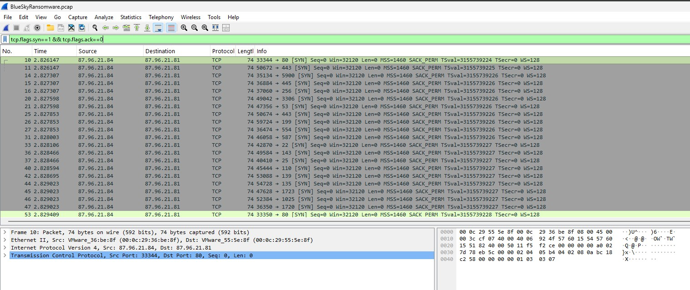
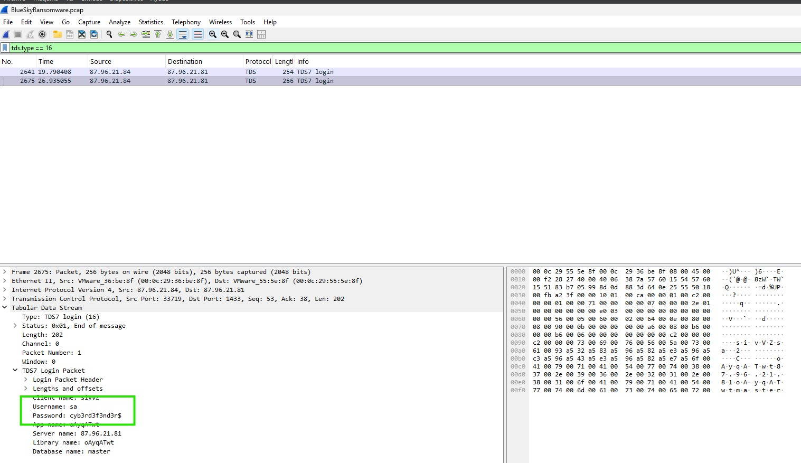
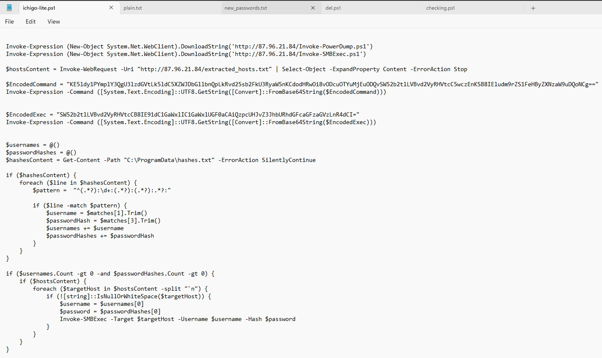
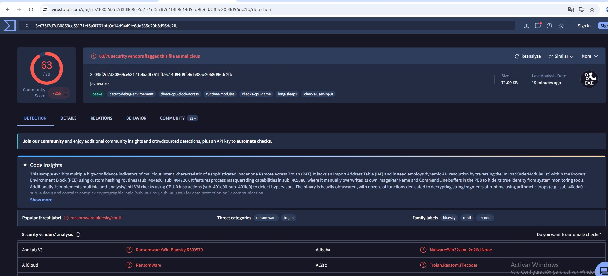

# Análisis de ransomware — BlueSky

**Fuente**: [CyberDefenders — BlueSky Ransomware](https://cyberdefenders.org/blueteam-ctf-challenges/bluesky-ransomware/)
**Herramientas**: Wireshark, Visor de eventos de Windows, VirusTotal

## Contexto

Investigación de una intrusión con despliegue final de ransomware **BlueSky**, a partir de una captura de tráfico de red (`.pcap`) y un registro de eventos de Windows (`.evtx`) del host comprometido. El objetivo es reconstruir la cadena completa del ataque: reconocimiento, acceso inicial, escalada de privilegios, movimiento lateral y despliegue del ransomware.

## Análisis

### 1. Reconocimiento — escaneo de puertos

Filtrando el tráfico TCP por intentos de conexión sin respuesta (`tcp.flags.syn==1 && tcp.flags.ack==0`), se identifica un escaneo de puertos masivo desde **`87.96.21.84`** contra **`87.96.21.81`**, con SYN dirigidos a múltiples puertos (80, 443, 445, 3389, 1433, 22, entre otros) en cuestión de milisegundos.



### 2. Acceso inicial — fuerza bruta contra SQL Server

El objetivo del escaneo incluía el puerto **1433** (SQL Server). En el registro de eventos, la aplicación `MSSQLSERVER` registra un intento de login fallido contra la cuenta **`sa`** (cuenta de administrador por defecto de SQL Server), con origen `87.96.21.84`.

Siguiendo el tráfico TDS (`tds.type == 16`, paquetes de login), se localizan dos intentos de autenticación. Inspeccionando el segundo paquete (`TDS7 Login Packet`) se extrae la contraseña utilizada: **`cyb3rd3f3nd3r$`** — el atacante obtuvo acceso válido a la instancia de SQL Server.



### 3. Habilitación de ejecución de comandos del sistema

Siguiendo el stream TCP completo de la sesión autenticada, se observa la habilitación del procedimiento almacenado extendido **`xp_cmdshell`**, deshabilitado por defecto en SQL Server precisamente por permitir ejecutar comandos del sistema operativo desde una consulta SQL:

```sql
EXEC master..sp_configure 'show advanced options', 1
RECONFIGURE
EXEC master..sp_configure 'xp_cmdshell', 1
RECONFIGURE
```

Esto marca el pivote de "acceso a base de datos" a "ejecución de comandos en el host".

### 4. Escalada de privilegios

En el registro de eventos, correlacionando actividad de PowerShell con procesos de alto privilegio, se identifica inyección de código sobre **`winlogon.exe`** — proceso que corre con privilegios SYSTEM — como mecanismo para obtener privilegios administrativos sin necesidad de un exploit de escalada adicional.

### 5. Descarga del kit de post-explotación

Vía `xp_cmdshell`, el host comprometido descarga una serie de scripts y herramientas desde la infraestructura del atacante (`87.96.21.84`), en este orden:

1. `http://87.96.21.84/checking.ps1` — script inicial: comprueba si el usuario actual pertenece al grupo Administradores local (SID **`S-1-5-32-544`**) y decide la rama de ejecución (privilegiada o no).
2. `http://87.96.21.84/del.ps1` — mata procesos de monitorización/análisis (`taskmgr`, `Procmon`, `Process Explorer`...) y elimina una suscripción de eventos WMI.
3. `http://87.96.21.84/ichigo-lite.ps1` — orquestador: descarga y encadena el resto de herramientas (dump de credenciales, movimiento lateral, payload final).

### 6. Deshabilitación de Windows Defender

Dentro de `checking.ps1`, la función `Disable-WindowsDefender` modifica el registro en `HKLM:\SOFTWARE\Microsoft\Windows Defender`, estableciendo a `1` las siguientes claves:

```powershell
DisableAntiSpyware
DisableRoutinelyTakingAction
DisableRealtimeMonitoring
SubmitSamplesConsent
SpynetReporting
```
Adicionalmente detiene y deshabilita el servicio `WinDefend`.

### 7. Persistencia

Se crea una tarea programada para mantener acceso recurrente:
```
\Microsoft\Windows\MUI\LPupdate
```
configurada para ejecutar un script PowerShell cada 4 horas con privilegios SYSTEM.

### 8. Dump de credenciales

`ichigo-lite.ps1` descarga y ejecuta **`Invoke-PowerDump.ps1`** (herramienta pública de la suite PowerSploit), volcando los hashes de contraseñas locales al fichero:
```
C:\ProgramData\hashes.txt
```



### 9. Descubrimiento y movimiento lateral

El script recupera el listado de hosts descubiertos en la red (`extracted_hosts.txt`) y, con las credenciales volcadas, ejecuta **`Invoke-SMBExec`** contra cada uno — movimiento lateral automatizado vía SMB.

### 10. Despliegue del payload y ransomware

Finalmente se descarga el payload **`javaw.exe`** (nombre que imita al binario legítimo de Java) desde `http://87.96.21.84/javaw.exe` a `C:\ProgramData\javaw.exe`.

El análisis de la muestra en VirusTotal confirma **63/70 motores** detectándola como maliciosa, con la etiqueta de amenaza **`ransomware.bluesky/conti`** — BlueSky es una familia derivada del código fuente filtrado de Conti en 2022. El binario emplea resolución dinámica de APIs (sin Import Address Table), process masquerading, técnicas anti-VM vía CPUID y ofuscación de strings en tiempo de ejecución.

El análisis de comportamiento (sandbox de VirusTotal) confirma el despliegue de la nota de rescate `# DECRYPT FILES BLUESKY #`, junto con ficheros cifrados con extensión `.bluesky`.



## IOCs

| Tipo | Valor |
|------|-------|
| IP atacante / C2 | `87.96.21.84` |
| IP host comprometido | `87.96.21.81` |
| URL — script inicial | `http://87.96.21.84/checking.ps1` |
| URL — evasión de defensas | `http://87.96.21.84/del.ps1` |
| URL — orquestador | `http://87.96.21.84/ichigo-lite.ps1` |
| URL — dump credenciales | `http://87.96.21.84/Invoke-PowerDump.ps1` |
| URL — movimiento lateral | `http://87.96.21.84/Invoke-SMBExec.ps1` |
| URL — payload final | `http://87.96.21.84/javaw.exe` |
| Fichero — credenciales volcadas | `C:\ProgramData\hashes.txt` |
| Fichero — hosts descubiertos | `extracted_hosts.txt` |
| Payload | `C:\ProgramData\javaw.exe` |
| Tarea de persistencia | `\Microsoft\Windows\MUI\LPupdate` |
| Nota de rescate | `# DECRYPT FILES BLUESKY #` |
| Extensión de cifrado | `.bluesky` |

## Mapeo MITRE ATT&CK

| Técnica | ID | Descripción en el caso |
|---------|-----|---------------------------|
| Network Service Discovery | [T1046](https://attack.mitre.org/techniques/T1046/) | Escaneo de puertos contra el host víctima |
| Brute Force | [T1110](https://attack.mitre.org/techniques/T1110/) | Ataque contra la cuenta `sa` de SQL Server |
| Exploit Public-Facing Application | [T1190](https://attack.mitre.org/techniques/T1190/) | Abuso de `xp_cmdshell` como vector de acceso inicial |
| Command and Scripting Interpreter | [T1059](https://attack.mitre.org/techniques/T1059/) | Ejecución de comandos vía `xp_cmdshell` y PowerShell |
| Process Injection | [T1055](https://attack.mitre.org/techniques/T1055/) | Inyección sobre `winlogon.exe` para escalar privilegios |
| Impair Defenses | [T1562.001](https://attack.mitre.org/techniques/T1562/001/) | Deshabilitación de Windows Defender y muerte de procesos de monitorización |
| Scheduled Task | [T1053.005](https://attack.mitre.org/techniques/T1053/005/) | Persistencia vía tarea programada `LPupdate` |
| OS Credential Dumping | [T1003](https://attack.mitre.org/techniques/T1003/) | Volcado de hashes con `Invoke-PowerDump` |
| Remote System Discovery | [T1018](https://attack.mitre.org/techniques/T1018/) | Descubrimiento de hosts (`extracted_hosts.txt`) |
| Lateral Movement (SMB/Windows Admin Shares) | [T1021.002](https://attack.mitre.org/techniques/T1021/002/) | Movimiento lateral con `Invoke-SMBExec` |
| Masquerading | [T1036](https://attack.mitre.org/techniques/T1036/) | Payload renombrado como `javaw.exe` |
| Obfuscated Files or Information | [T1027](https://attack.mitre.org/techniques/T1027/) | Ofuscación de strings y resolución dinámica de APIs en el payload |
| Data Encrypted for Impact | [T1486](https://attack.mitre.org/techniques/T1486/) | Cifrado final de archivos (extensión `.bluesky`) |
