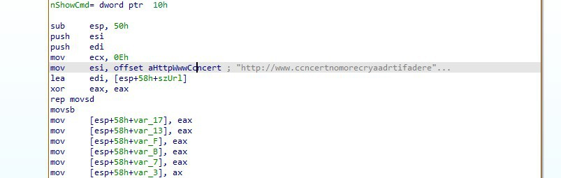
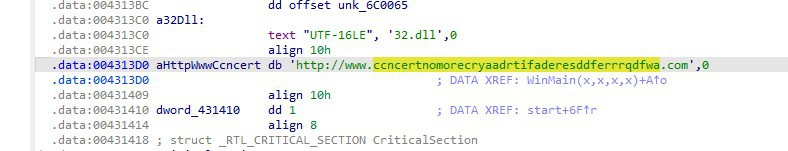

# Análisis de ransomware — WannaCry

**Herramientas**: VirusTotal, ID Ransomware, NoMoreRansom, IDA Free

## Contexto

Identificación y análisis de una muestra de ransomware, combinando OSINT sobre IOCs (hash, nota de rescate) con ingeniería inversa estática del binario para extraer el dominio de C2 embebido.

## Análisis

### 1. Identificación de la muestra por hash

Consultando el hash MD5 de la muestra en [VirusTotal](https://www.virustotal.com), se identifica como perteneciente a la familia **GandCrab**.

### 2. Identificación de familia a partir de la nota de rescate

Subiendo la nota de rescate junto con una muestra del archivo cifrado a [ID Ransomware](https://id-ransomware.malwarehunterteam.com/), la herramienta identifica la familia como **Locky**.

### 3. Disponibilidad de descifrador

Consultando el catálogo de descifradores en [NoMoreRansom](https://www.nomoreransom.org/), se determina que **EKING** es la única familia sin herramienta de descifrado pública disponible.

### 4. Binario abusado para eliminar Shadow Copies

El binario de Windows responsable de gestionar las copias de volumen (Shadow Copies) — objetivo habitual del ransomware para impedir la recuperación de archivos — es **`vssadmin.exe`**.

### 5. Descifrado del archivo

Con la muestra identificada como GandCrab, se descarga la herramienta de descifrado correspondiente desde NoMoreRansom y se aplica sobre el archivo cifrado de muestra. El contenido recuperado revela el texto **`DontPayRansom!!!`**.

### 6. Extracción del dominio C2 mediante análisis estático

Abriendo la muestra en **IDA Free**, se localiza en la sección `.data` una referencia a una URL embebida (`aHttpWwwCcncert`), referenciada desde `WinMain`. Al inspeccionarla se obtiene la cadena completa:

```
http://www.ccncertnomorecryaadrtifaderesddferrrqdfwa.com
```





Este dominio corresponde al **kill switch** característico de WannaCry: el malware comprueba si el dominio resuelve antes de proceder con el cifrado, mecanismo que fue aprovechado en 2017 para detener la propagación real del brote.

```asm
.data:004313D0 aHttpWwwCcncert db 'http://www.ccncertnomorecryaadrtifaderesddferrrqdfwa.com',0
.data:004313D0                                         ; DATA XREF: WinMain(x,x,x,x)+A1o
```

## IOCs

| Tipo | Valor |
|------|-------|
| Dominio (kill switch) | `www.ccncertnomorecryaadrtifaderesddferrrqdfwa.com` |
| Binario abusado (LOLBin) | `vssadmin.exe` |

## Mapeo MITRE ATT&CK

| Técnica | ID | Descripción en la muestra |
|---------|-----|---------------------------|
| Inhibit System Recovery | [T1490](https://attack.mitre.org/techniques/T1490/) | Uso de `vssadmin.exe` para eliminar Shadow Copies |
| Data Encrypted for Impact | [T1486](https://attack.mitre.org/techniques/T1486/) | Cifrado de archivos del sistema |
| Application Layer Protocol | [T1071](https://attack.mitre.org/techniques/T1071/) | Comprobación HTTP del dominio kill switch antes de cifrar |

